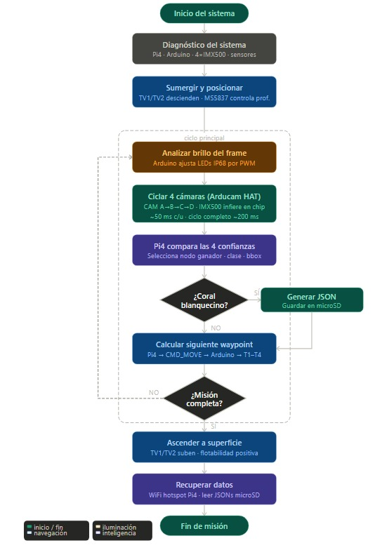
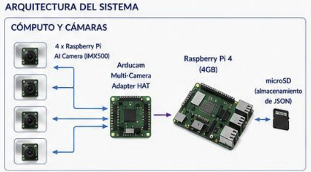
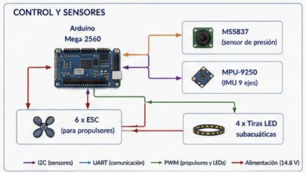
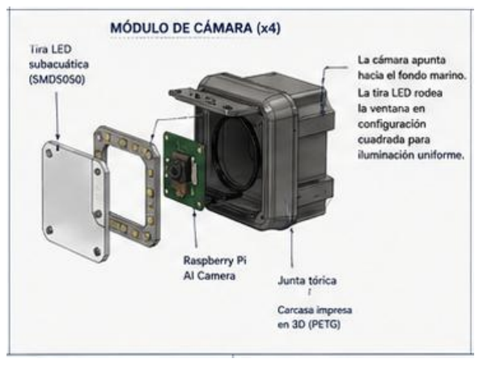
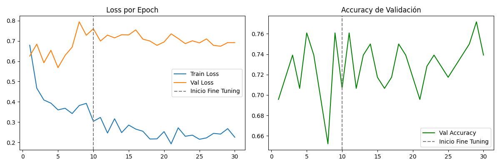
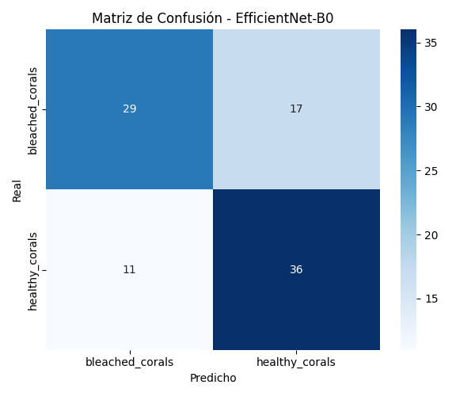
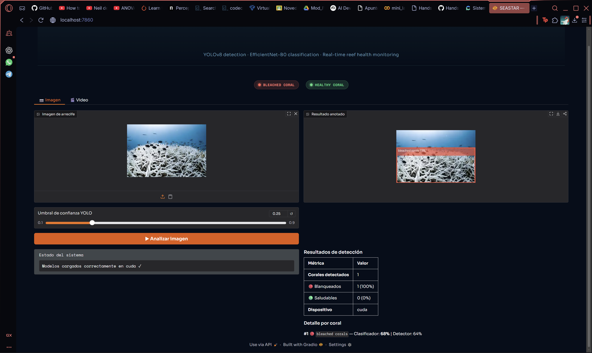

# 🌊 ASTER — Autonomous Submarine Technology for Ecological Reef-monitoring

> **Bio-inspired underwater ROV for coral reef health monitoring in Latin America and the Caribbean**  
> *Inspired by the nervous system and photoreceptors of the sea star (Asteroidea)*


[](LICENSE)
[](https://www.python.org/)
[](https://pytorch.org/)
[](https://ultralytics.com/)
[](https://tide.ox.ac.uk/)

---

## 📋 Table of Contents

- [About the Project](#about-the-project)
- [Biological Inspiration](#biological-inspiration)
- [System Architecture](#system-architecture)
- [Computer Vision Pipeline](#computer-vision-pipeline)
- [Robot Design](#robot-design)
- [Results](#results)
- [Demo](#demo)
- [Installation](#installation)
- [Usage](#usage)
- [Project Structure](#project-structure)
- [Team](#team)
- [References](#references)

---

## 🐠 About the Project

ASTER is a low-cost autonomous underwater observation ROV (< $1,500 USD) designed to monitor coral reef health using computer vision and artificial intelligence. The system detects coral structures and classifies their health status as **healthy** or **bleached** in real time.

Coral reefs cover less than 0.1% of the ocean floor but support approximately **25% of all marine biodiversity**. In Latin America and the Caribbean — including Panama's reefs on both the Pacific and Caribbean coasts, and the **Amazon Reef system** (9,500+ km²) at the mouth of the Amazon River — coral bleaching driven by climate change represents an urgent ecological and economic crisis.

Current monitoring tools (commercial ROVs, satellite remote sensing, professional dive surveys) cost between **$5,000–$50,000**, making them inaccessible to research institutions, NGOs, and local governments in developing countries. ASTER proposes a replicable, open-design alternative built with globally available components.

This project was developed for the **[Ideatón de Innovación Inspirada en la Inteligencia de la Naturaleza 2025](https://tide.ox.ac.uk/)**, organized by the TIDE Centre at the University of Oxford and CAF — Development Bank of Latin America and the Caribbean.

---

## ⭐ Biological Inspiration

ASTER's architecture is directly inspired by two characteristics of the sea star (*Asteroidea*):

### 1. Decentralized Nervous System
Sea stars lack a central brain. Their nervous system consists of a **central nerve ring** and **radial nerve cords** extending into each arm. Each cord processes local stimuli semi-autonomously while the central ring integrates signals and determines overall movement direction — allowing complex coordination without a central control organ.

**→ Engineering translation:** Each corner of ASTER's chassis houses its own Raspberry Pi AI Camera that performs inference locally on its Sony IMX500 chip. The Raspberry Pi 4 acts exclusively as the integrating nerve ring — receiving preprocessed results, selecting the highest-confidence detection, and emitting a consolidated JSON diagnostic. If one node fails, the others continue operating.

### 2. Ocelli — Distributed Photoreceptors
Sea stars possess **ocelli** at the tip of each arm: simple photoreceptor structures that detect light gradients and connect directly to the radial nerve cords, providing complementary visual information from multiple angles simultaneously.

**→ Engineering translation:** ASTER's four cameras replicate this mechanism — each capturing a distinct visual field of the underwater environment, achieving wide angular coverage that a single central camera could not match.


---

## 🏗️ System Architecture



**Key specs:**
- Operating depth: 0.5 – 2 meters
- Propulsion: 6x brushless thrusters (4 horizontal @ 45°, 2 vertical)
- Chassis: Open-frame 3D printed
- Power: 2x LiPo 4S 10,000 mAh
- Data storage: microSD (JSON diagnostics)
- Estimated build cost: < $1,500 USD





---

## 🤖 Computer Vision Pipeline

The AI pipeline runs in two stages:

```
Underwater image
      ↓
  YOLOv8n ──────────────── Detects and localizes coral regions
      ↓                    (bounding boxes)
  ROI Crop
      ↓
  EfficientNet-B0 ──────── Classifies: Healthy | Bleached
      ↓
  JSON output: {class, confidence, camera_source, bounding_box}
```

### Models

| Model | Task | Dataset | 
|-------|------|---------|
| YOLOv8n | Coral detection | CoralBase Detector v6 (1,302 images) — Roboflow |
| EfficientNet-B0 | Health classification | Healthy and Bleached Corals (923 images) — Kaggle |

### Training Strategy — EfficientNet

Fine-tuning in two phases:
- **Phase 1:** Frozen backbone, only custom classification head trained
- **Phase 2:** Full model unfrozen, fine-tuned with low learning rate (1e-5)

Custom classification head:
```python
nn.Linear(1280, 1024) → BatchNorm → ReLU → Dropout(0.4) → nn.Linear(1024, 2)
```

<!-- AGREGAR: Curvas de entrenamiento -->
<!--  -->

<!-- AGREGAR: Matriz de confusión -->
<!--  -->

---

<!-- ## 🎨 Robot Design

<!-- AGREGAR: Planos técnicos del chasis -->
<!--  -->

<!-- AGREGAR: Diagrama de propulsores -->
<!--  -->

<!-- AGREGAR: Diagrama de módulo de cámara sellado -->
<!--  -->

---

## 🖥️ Demo

Interactive demo built with Gradio — upload an underwater coral video and get real-time detection and classification results.

<!-- AGREGAR: GIF del demo funcionando -->


```bash
python demo/demo.py
```

<!-- AGREGAR: Screenshots de la interfaz Gradio -->
<!--  -->

<p align="center">
  
</p>


---

## ⚙️ Installation

### Requirements
- Python 3.12
- CUDA 12.4+ (recommended)
- Conda

### Setup

```bash
# Clone the repository
git clone https://github.com/andreap1625/seastar-project.git
cd seastar-project

# Create environment
conda env create -f seastar.yml
conda activate seastar

# Copy environment variables template
cp .env.example .env
# Edit .env and add your API keys
```

### Environment Variables

```bash
# .env.example
ROBOFLOW_API_KEY=your_key_here
```

---

## 🚀 Usage

### Download Datasets

```bash
# Coral detection dataset (Roboflow)
python scripts/dt_download.py

# Classification dataset (Kaggle)
python scripts/dt_kaggle_download.py
```

### Train Models

```bash
# Train YOLOv8 coral detector
python src/train_yolo.py

# Train EfficientNet classifier
python src/train_efficientnet.py
```

### Run Inference on Video

```bash
python src/inference.py --source test_samples/coral_reef_v.mp4
```

### Run Full Pipeline

```bash
python src/pipeline.py --source test_samples/coral_reef_v.mp4
```

### Launch Demo

```bash
python demo/demo.py
```

---

## 📁 Project Structure

```
seastar-project/
│
├── models/                          # Trained model weights
│   ├── best_efficientnet.pth
│   └── yolov8n.pt
│
├── src/                             # Core source code
│   ├── pipeline.py                  # End-to-end YOLO + EfficientNet pipeline
│   ├── inference.py                 # Single model inference
│   ├── train_yolo.py                # YOLOv8 training script
│   └── train_efficientnet.py        # EfficientNet training script
│
├── scripts/                         # Utility scripts
│   ├── dt_download.py               # Roboflow dataset download
│   └── dt_kaggle_download.py        # Kaggle dataset download
│
├── demo/                            # Gradio web interface
│   └── demo.py
│
├── results/                         # Metrics and visualizations
│   ├── confusion_matrix.png
│   └── training_curves.png
│
├── docs/                            # Documentation and design files
│   └── (diagrams, renders, technical drawings)
│
├── .env.example                     # Environment variables template
├── .gitignore
├── LICENSE
├── README.md
└── seastar.yml                      # Conda environment
```

---

## 🏆 Competition

This project was submitted to the **Ideatón de Innovación Inspirada en la Inteligencia de la Naturaleza 2025**, organized by:
- [TIDE Centre — University of Oxford](https://tide.ox.ac.uk/)
- [CAF — Development Bank of Latin America and the Caribbean](https://www.caf.com/)

As part of the **Nature's Intelligence Studio**, launched at COP30, Belém, Brazil.


---

## 📄 License

This project is licensed under the MIT License — see the [LICENSE](LICENSE) file for details.

---

<p align="center">
  Made with 🌊 in Panama — for the reefs of Latin America and the Caribbean
</p>
